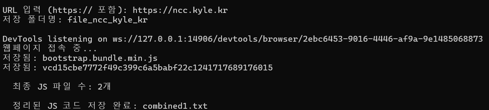
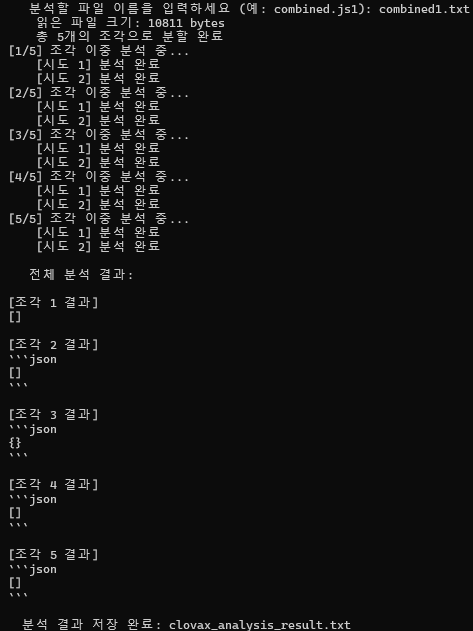
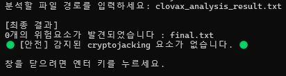

# Project1
> 사이트의 **크립토재킹(Cryptojacking)** 코드를 Naver Clova API로 탐지하는 도구입니다.<br/>


## 설치 방법
```bash
git clone https://github.com/jhs-322/project1.git
cd project1
pip install -r requirements.txt
python Main.py
```
<br/>

## 사용 방법
### 🔎 1단계: URL 입력
- 검사할 웹사이트의 URL을 입력하면,
- 해당 URL에서 JavaScript 파일을 자동 추출하여 .txt 파일로 저장합니다.


### 🧠 2단계: JS 코드 분석
- 저장된 JS 텍스트 파일을 지정하면,
- Clova API를 이용해 의심 키워드를 분석하고 결과를 새로운 .txt 파일로 저장합니다.


### 🚨 3단계: 위험도 평가
- 분석 결과 파일을 지정하면,
- 안전/위험/고위험으로 위험도를 출력합니다.

